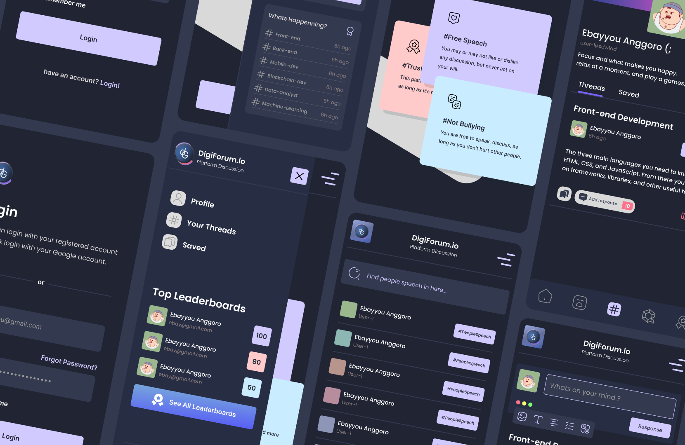

# DigiForum Component Library

This is a component library built with Next.Js, Tailwind CSS and Storybook from [this design](https://www.figma.com/community/file/1227912702034646627/digiforum-apps)



## Tech Stack

- [Next.Js](https://nextjs.org/)
- [Tailwind CSS](https://tailwindcss.com/)
- [Storybook](https://storybook.js.org/)
- [Chromatic](https://www.chromatic.com/)

## Installation

### 1. Clone the repository

```bash
git clone https://github.com/JrFelix540/digi-forum.git
```

### 2. Install dependencies

```bash
npm install
```

### 3. Run the application

```bash
npm run storybook
```
